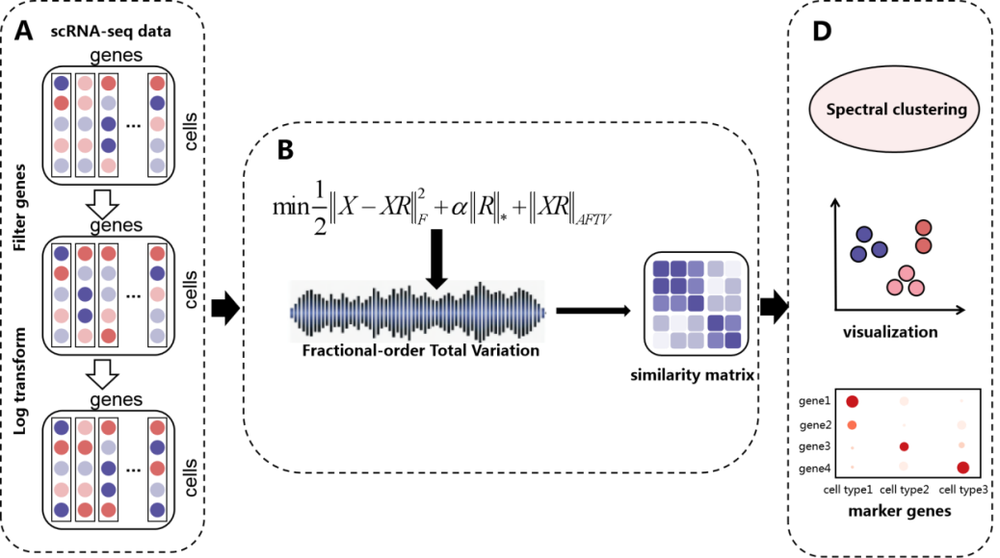

# AFTV-LRR for scRNA-seq Clustering (MATLAB)

This repository contains a MATLAB implementation of **AFTV-LRR** for **single-cell RNA-seq (scRNA-seq) clustering**, along with scripts for running experiments and (optionally) baseline methods used in our manuscript.

## Workflow

## Highlights

- Representation learning + graph/TV regularization for robust scRNA-seq clustering.
- MATLAB implementation with a single entry point: **`main.m`**.
- Scripts/utilities for clustering and evaluation (e.g., ARI/NMI), depending on your configuration.

## Requirements

- **MATLAB** (R2018a+ recommended; newer versions are fine).
- Standard MATLAB toolboxes for matrix computation and plotting (as required by your environment).

## Quick Start

### 1) Prepare data

We do **not** host raw scRNA-seq datasets in this repository.
Please download datasets from their public sources (as described in the manuscript), then place them locally and update the dataset path in `main.m`.

A suggested local layout is:

